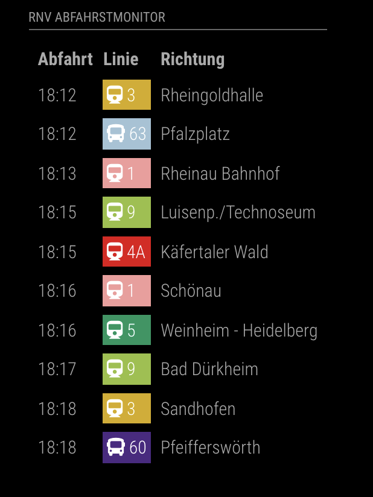

# MMM-RNV

[](https://github.com/jalibu/MMM-RNV/releases) [](https://snyk.io/test/github/jalibu/MMM-RNV?targetFile=package.json)

This is a departure monitor for the Rhein-Neckar-Verkehr (RNV) public transport network for the [MagicMirror²](https://magicmirror.builders/) platform.  
It shows upcoming departures with their destination, type, delay and platform.

Contribution welcome.

## Demo



## Installing the Module

1. Navigate to the `MagicMirror/modules` directory and execute the following command

    ```sh
    git clone https://github.com/jalibu/MMM-RNV
    ```

2. Change into the MMM-RNV module folder and install runtime dependencies with

    ```sh
    cd MMM-RNV
    npm install --only=production
    ```

3. Request your API Key here: [Data Hub API](https://www.opendata-oepnv.de/ht/de/organisation/verkehrsunternehmen/rnv/openrnv/api). Select **GraphQL** (not GTFS) in the form.

4. [Find the stationId](https://rnvopendataportalpublic.blob.core.windows.net/public/openDataPortal/liniengruppen_mit_haltestellenreferenz.json) of the station that should be displayed.

5. Add the module configuration into the `config.js` file (sample configuration):

    ```javascript
        {
          module: "MMM-RNV",
          position: "top_left",
          config: {
            animationSpeedMs: 2 * 1000, // 2 seconds
            credentials: {
              clientId: "",
              clientSecret: "",
              resourceId: "",
              tenantId: "",
            },
            excludeLines: [], // example ["N1", "5"]
            excludePlatforms: [], // example ["A"]
            highlightLines: [], // example ["1"]
            maxResults: 10,
            showLineColors: true,
            showPlatform: false,
            showTableHeadersAsSymbols: false,
            stationId: '2417',
            timeformat: 'HH:mm',
            updateIntervalMs: 1 * 60 * 1000, // every 1 minute
            walkingTimeMs: 3 * 60 * 1000 // 3 minutes footwalk
          }
        },
    ```

## Options

| Option                      | Description                                                                                                                                       |
| --------------------------- | ------------------------------------------------------------------------------------------------------------------------------------------------- |
| `animationSpeedMs`          | Duration of fade-in animation. <br><br>**Type:** `int` <br> **Default value:** `2000`                                                             |
| `credentials`               | Your RNV API credentials. <br><br>**Type:** `Credentials` <br> **Default value:** `empty object`                                                  |
| `excludeLines`              | List of excluded lines. <br><br>**Type:** `string array` <br> **Default value:** `[]`                                                             |
| `excludePlatforms`          | List of excluded platforms, e.g. if you only want to see one direction. <br><br>**Type:** `string array` <br> **Default value:** `[]`             |
| `highlightLines`            | List of highlighted lines. <br><br>**Type:** `string array` <br> **Default value:** `[]`                                                          |
| `maxResults`                | Limits number of results. <br><br>**Type:** `int` <br> **Default value:** `10`                                                                    |
| `showLineColors`            | Set to true, to colorize the lines. <br><br>**Type:** `boolean` <br> **Default value:** `true`                                                    |
| `showPlatform`              | Set to true, to display platform. <br><br>**Type:** `boolean` <br> **Default value:** `false`                                                     |
| `showTableHeadersAsSymbols` | Set to true, to show symbols instead of texts in header. <br><br>**Type:** `boolean` <br> **Default value:** `false`                              |
| `stationId`                 | ID of the station that should be displayed.<br><br>**Type:** `int` <br> **Default value:** `2417` (Mannheim Hbf)                                  |
| `timeformat`                | Time format for the departure time. <br><br>**Type:** `string` <br> **Default value:** `HH:mm`                                                    |
| `updateIntervalMs`          | Determines how often updates should be loaded from server. <br><br>**Type:** `int` <br> **Default value:** `60000` (every 1 minute)               |
| `walkingTimeMs`             | Filter for departures that are reachable considering the walking time.<br><br>**Type:** `int` <br> **Default value:** `3 * 60 * 1000` (3 minutes) |

## Credentials Object

| Option         | Description                                                              |
| -------------- | ------------------------------------------------------------------------ |
| `clientId`     | Your clientId. <br><br>**Type:** `string` <br> **Default value:** ``     |
| `resourceId`   | Your resourceId. <br><br>**Type:** `string` <br> **Default value:**``    |
| `clientSecret` | Your clientSecret. <br><br>**Type:** `string` <br> **Default value:** `` |
| `tenantId`     | Your tenantId. <br><br>**Type:** `string` <br> **Default value:**``      |

## Contribution and Development

This module is written in TypeScript and compiled with Rollup.  
The source files are located in the `/src` folder.
Compile target files with `npm run build`.

Contribution for this module is welcome!

## Thanks to

- [jupadin](https://github.com/jupadin)
- [yawnsde](https://github.com/yawnsde)
